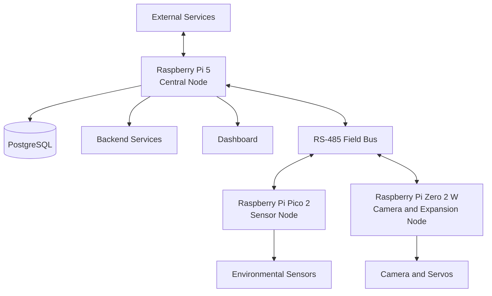

# Weather Station

<p align="center">
  <strong>An end-to-end environmental monitoring platform built around the Raspberry Pi ecosystem.</strong>
</p>

<p align="center">
  Embedded systems · Distributed telemetry · Backend engineering · Electronics · CAD
</p>

<p align="center">
  🚧 <strong>Active development — Modbus RTU register map v1 over the Pi-Pico UART link</strong>
</p>

---

## Overview

Weather Station is a modular platform for collecting, transporting, storing, and eventually visualizing environmental observations.

A Raspberry Pi 5 acts as the central node, coordinating remote devices, persisting telemetry in PostgreSQL, and hosting the future backend services. Raspberry Pi Pico devices handle sensor acquisition close to the physical instruments, while a Raspberry Pi Zero 2 W is reserved for camera control, local processing, and other capabilities that require a Linux-based remote node.

The project is intentionally broader than a conventional hobby weather station. It is being developed as an end-to-end engineering system in which embedded software, electronics, mechanical design, networking, backend development, and data engineering must work together as one product.

---

## Why This Project Exists

The primary goal is not simply to measure temperature or humidity. The goal is to design and build a complete distributed system from first principles.

That includes deciding how devices communicate, how failures are detected, how measurements are validated, how state is persisted, and how physical components are protected from weather and maintained over time.

The project also serves as a practical learning and portfolio platform. Each subsystem introduces a different engineering problem:

- embedded control and sensor acquisition;
- reliable communication over constrained links;
- event scheduling and message prioritization;
- Linux services and backend architecture;
- time-series data modeling;
- electrical protection and power distribution;
- mechanical design and additive manufacturing;
- system recovery and long-term operation.

Rather than treating these as isolated exercises, the station provides a single product in which every decision has consequences across the full system.

---

## Architecture



The Raspberry Pi 5 is responsible for coordination and higher-level processing rather than direct real-time interaction with every sensor. Sensor acquisition is delegated to embedded nodes so that timing-sensitive hardware responsibilities remain separated from the backend and operating system.

RS-485 was selected as the planned physical layer for the outdoor bus because it supports differential signaling, long cable runs, and electrically noisy environments better than short-distance interfaces such as I²C or direct TTL UART.

UART is being used first as the simplest way to validate communication between the Pi and Pico before introducing RS-485 transceivers and the complete field wiring.

---

## Telemetry and Device Communication

The communication layer is being designed around **ATP (Agnostic Telemetry Protocol)**, a transport-independent telemetry protocol that originated as part of this project.

Most industrial serial protocols, including Modbus RTU, are built around synchronous master-slave polling: a slave device only speaks when the master asks it a question, and there is no native way for it to report something on its own initiative. This works well for periodic register reads, but it does not map cleanly onto conditions this station needs to represent as first-class events — a node detecting an imminent power loss, a sensor failing between poll cycles, or a communication fault that should be reported immediately rather than waiting for the next scheduled query.

ATP is designed to separate application-level concepts — device identity, telemetry, acknowledgements, heartbeats, faults, and prioritized events — from the physical transport carrying them. A message such as a heartbeat or a fault report is defined once, at the protocol level, and can travel over UART, RS-485, or Wi-Fi without being redesigned for each medium. A minimal ATP frame looks conceptually like:

```text
[dest_id][src_id][msg_type][seq][payload][checksum]
```

Modbus RTU was studied closely during the design of ATP — not only as a reference, but as an intermediate transport actually implemented for Phase 2: the Pi (PyModbus) drives the Pico (`micropython-modbus`) over the same UART link validated in Phase 1, using a versioned register map ([`docs/Phase 2/p2_modbus_register_map_v1.md`](docs/Phase%202/p2_modbus_register_map_v1.md)) instead of the earlier ad hoc text/JSON commands. This gave the project firsthand experience with a mature protocol's approach to framing, addressing, and bus arbitration before ATP replaces it. ATP borrows from that foundation while extending it with asynchronous event reporting, message prioritization, and transport independence that Modbus's polling model does not provide.

ATP will live in a separate repository so that its protocol specification and implementations can evolve independently from the weather-station application. A direct repository link will be added here once it is publicly available.

---

## Design Principles

### Modularity

The system is divided into nodes and services with explicit responsibilities. A sensor, communication transport, storage implementation, or enclosure should be replaceable without requiring the entire station to be redesigned.

### Reliability

The station is intended for unattended operation. Communication failures, interrupted power, invalid measurements, and unavailable nodes are treated as normal operating conditions that the system must detect and handle.

### Observability

A functioning station must explain its own state. Device health, communication status, pending events, sensor failures, and power-related incidents should be visible rather than hidden inside logs or silent timeouts.

### Maintainability

The repository, hardware layout, protocol definitions, and deployment process are being documented as the project grows. The objective is not only to make the station work, but to keep it understandable months or years later.

### Reusability

Some components — particularly ATP, event scheduling, device coordination, and telemetry handling — are being designed so they can support future distributed embedded projects beyond weather monitoring.

---

## Core System

| Component | Responsibility |
|---|---|
| Raspberry Pi 5 | Central coordination, persistence, API hosting, scheduling, and system management |
| Raspberry Pi Pico 2 | Deterministic sensor acquisition and embedded control |
| Raspberry Pi Zero 2 W | Camera control, servo operation, local Linux services, and remote expansion |
| PostgreSQL | Telemetry, device state, configuration, system events, and operational history |
| RS-485 | Planned wired field bus between the central system and outdoor nodes |
| UART | Initial development transport for Pi-to-Pico communication |
| ATP | Application-level telemetry and device communication protocol |
| Fusion 360 | Mechanical design, printable components, assemblies, and future PCB work |
| 3D printing | Enclosures, shields, mounts, brackets, and rapid mechanical prototyping |

---

## Environmental Monitoring

The final sensor suite has not been frozen because the project is still validating its physical and electrical architecture.

The station is expected to observe variables such as temperature, humidity, atmospheric pressure, rainfall, wind speed, and wind direction. Sensor selection will be driven by measurement quality, weather resistance, maintainability, interface constraints, and the ability to calibrate the complete assembly — not simply by which modules are easiest to connect.

This distinction matters because a weather station measures the behavior of a complete installation. Sensor placement, solar radiation, enclosure ventilation, cable length, mechanical alignment, and environmental exposure can affect the results as much as the sensor model itself.

---

## Data and Backend

PostgreSQL has been installed on the Raspberry Pi 5 and will serve as the initial system of record.

The database is expected to hold more than raw measurements. It will also preserve information required to understand how the station was operating when those measurements were produced, including device identity, sensor configuration, communication health, power-loss events, validation results, and system status.

The backend will initially run directly on Raspberry Pi OS so that the behavior of Linux services, Python environments, PostgreSQL, hardware access, and process supervision can be understood without an additional abstraction layer.

Containerization may be introduced later through Docker when the project has multiple deployable services and a concrete need for reproducible environments. Docker is therefore treated as a deployment tool to be learned in context, not as a prerequisite added before its purpose is clear.

---

## Mechanical and Electronic Design

The physical station will require more than a generic electronics box.

Outdoor sensors need shielding from solar radiation and rain while retaining sufficient airflow. Wind and rainfall instruments require stable alignment and appropriate mounting. Electronics need protected cable entry, voltage conversion, service access, strain relief, and electrical safeguards against faults on a long outdoor connection.

Fusion 360 will be used for both mechanical design and, when appropriate, PCB development. The repository versions editable `.f3d` files and printable `.stl` exports, while machine-specific G-code and temporary slicer files remain outside version control.

This provides a clear distinction between:

- the editable engineering source;
- the exported manufacturing geometry;
- the printer-specific instructions generated at production time.

---

## Repository Structure

```text
weather-station/
├── backend/
├── docs/
├── experiments/
├── firmware/
│   ├── pico/
│   └── zero/
├── hardware/
│   └── cad/
│       ├── exports/
│       └── source/
├── infrastructure/
├── .gitignore
├── LICENSE
└── README.md
```

| Directory | Purpose |
|---|---|
| `backend/` | Central application services, persistence, scheduling, API, and telemetry processing |
| `firmware/pico/` | Embedded software for Raspberry Pi Pico nodes |
| `firmware/zero/` | Project-specific software for the Raspberry Pi Zero expansion node |
| `hardware/cad/source/` | Editable Fusion 360 `.f3d` files |
| `hardware/cad/exports/` | Printable `.stl` files |
| `docs/` | Architecture, protocols, diagrams, design decisions, BOMs, and operating procedures |
| `experiments/` | Isolated prototypes and proofs of concept before production integration |
| `infrastructure/` | Deployment configuration, Linux services, backups, provisioning, and future containerization |

---

## Development Method

Subsystems are first explored through focused experiments before they become part of the main implementation.

For example, direct UART communication between the Pi and Pico will be validated independently before introducing RS-485. Sensor readout will be tested before it is combined with telemetry serialization. Database ingestion will be exercised before the complete API is built.

This keeps early learning code useful without allowing experimental assumptions to become accidental production architecture.

Representative experiments include:

```text
experiments/
├── uart-pi-pico/
├── rs485-loopback/
├── sensor-readout/
├── postgres-ingestion/
└── power-loss-detection/
```

---

## Current Status

The project foundation is operational:

- Raspberry Pi OS is installed on the central node.
- Remote development works through SSH and Visual Studio Code.
- SSH password authentication has been disabled in favor of keys.
- Git has been configured.
- PostgreSQL has been installed.
- The monorepo structure has been established.
- The initial project documentation is being created.
- **Phase 1 is complete.** Bidirectional UART communication between the Raspberry Pi 5 and a Raspberry Pi Pico 2 works end to end, including a command protocol (`PING`, `STATUS`, `START`, `STOP`, `SET_INTERVAL`, `READ_NOW`), a DHT11 sensor node reporting JSON telemetry that the Pi validates, queues, and persists into PostgreSQL without blocking the UART read loop, connection-liveness tracking with automatic state reconciliation after a reconnect, and a first derived metric (dew point, via the Magnus formula) computed from stored raw readings by an independent process. Validated with a 23h25m continuous run with zero data loss.
- **Phase 2 is complete.** The ad hoc UART command/telemetry format has been replaced with a Modbus RTU contract. Register Map v1.0 is published and frozen ([`docs/Phase 2/p2_modbus_register_map_v1.md`](docs/Phase%202/p2_modbus_register_map_v1.md)), with a reusable, resilient Pi-side client, Pico-side server firmware implementing the full control contract, and an automated integration suite passing 19/19 tests.

The next technical milestone is designing the first ATP message implementations on top of this validated Modbus foundation, before the RS-485 migration and additional sensors are introduced.

---

## Roadmap

Development is organized around a small number of major milestones:

| Phase | Focus | Status |
|---|---|---|
| 1 | Development environment and repository foundation | Complete |
| 2 | Pi-to-Pico communication and initial ATP messages | In progress |
| 3 | Sensor acquisition and PostgreSQL ingestion | Complete |
| 4 | RS-485 field bus and distributed device scheduling | Planned |
| 5 | Backend API, dashboard, and operational monitoring | Planned |
| 6 | Outdoor hardware, enclosures, and electrical protection | Planned |
| 7 | Camera node, external services, and advanced analytics | Future |

The detailed implementation roadmap will be maintained in [`docs/roadmap.md`](docs/roadmap.md) as tasks and design dependencies become concrete.

---

## Technology Stack

| Area | Technology |
|---|---|
| Central operating system | Raspberry Pi OS |
| Backend | Python |
| Embedded development | MicroPython, with C/C++ considered where needed |
| Database | PostgreSQL |
| API | FastAPI, planned |
| Communication | UART, RS-485, Wi-Fi, and ATP |
| Development environment | Visual Studio Code Remote SSH |
| Version control | Git and GitHub |
| Mechanical design | Fusion 360 |
| PCB design | Fusion 360, planned |
| Deployment | Native Linux services initially; Docker to be evaluated later |
| Visualization | Web dashboard, planned |

---

## Documentation

Technical documentation will live under `docs/` rather than expanding the root README indefinitely.

It will include the protocol specification, system architecture, database design, power distribution, wiring, device roles, hardware decisions, deployment procedures, recovery processes, and the complete roadmap.

The README is intended to remain the entry point: it explains what the project is, why its architecture exists, what has already been built, and where to find deeper technical material.

Notable changes across the project are tracked in [`CHANGELOG.md`](CHANGELOG.md).

---

## Gallery

Photographs, diagrams, CAD renders, printed components, electronic assemblies, communication tests, and dashboard screenshots will be added as the physical system develops.

---

## Project Scope

This is currently a personal engineering and portfolio project under active development.

The architecture is being designed with reliability and reuse in mind, but the system is not yet production-ready and should not be used for safety-critical monitoring or as a certified source of meteorological observations.

---

## License

This project is licensed under the [Apache License 2.0](LICENSE).

Copyright © 2026 PDJ-E